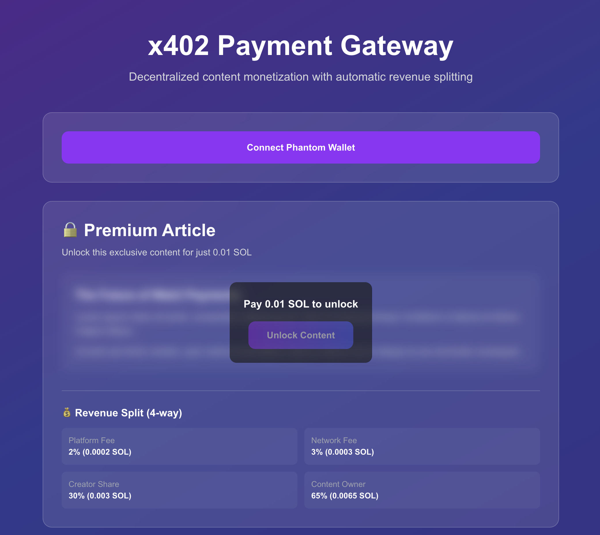

# x402 Payment Gateway

> Decentralized content monetization with automatic revenue splitting



**Built by [infraxa.ai](https://infraxa.ai)** - Enabling internet-native micro-payments for HTTP resources

---

## 🌟 What is x402?

x402 is an open payment protocol that enables **micro-payments for HTTP resources** using the HTTP 402 "Payment Required" status code. It provides a standardized way to monetize digital content with automatic revenue splitting, minimal integration complexity, and sub-second settlement times.

### Key Features

- 💰 **Micro-Payments** - Start at $0.001 with 2-second settlement
- ⚡ **Gasless** - No gas fees for clients or resource servers
- 🔄 **Automatic Revenue Split** - Configurable 4-way split on every transaction
- 🔗 **Chain Agnostic** - Supports EVM networks and Solana
- 🛠️ **Easy Integration** - 1 line for server, 1 function for client
- 🔐 **Decentralized** - Permissionless and trust-minimizing
- 🌐 **HTTP Native** - Seamlessly complements existing HTTP requests

---

## 🎯 Revenue Splitting

Every payment is automatically split according to your configuration:

| Recipient | Percentage | Example (0.01 SOL) |
|-----------|------------|-------------------|
| **Platform Fee** | 2% | 0.0002 SOL |
| **Network Fee** | 3% | 0.0003 SOL |
| **Creator Share** | 30% | 0.003 SOL |
| **Content Owner** | 65% | 0.0065 SOL |

*Revenue splits are configurable and executed automatically on-chain.*

---

## 🚀 Quick Start

### Prerequisites

- Node.js 18+ installed
- Phantom wallet browser extension
- Devnet SOL from [Solana Faucet](https://faucet.solana.com/)

### Installation

```bash
# Clone the repository
git clone https://github.com/infraboy/x402-demo.git
cd x402-demo

# Install dependencies
npm install

# Run development server
npm run dev
```

Open [http://localhost:3000](http://localhost:3000) to see the demo.

### Configuration

The demo is configured for **Solana Devnet** by default. Key configuration files:

- **`src/components/PaymentDemo.tsx`** - Line 8: `RPC_URL = 'https://api.devnet.solana.com'`
- **`src/lib/x402.ts`** - Lines 7-11: Program ID and wallet addresses

**To switch to Mainnet:**
1. Update `RPC_URL` to `'https://api.mainnet-beta.solana.com'`
2. Ensure all wallet addresses are funded on mainnet
3. Test thoroughly with small amounts first
4. **⚠️ Use at your own risk - verify all transactions before signing**

---

## 💡 How It Works

### Payment Flow

1. **Client Requests Resource** → Server responds with `402 Payment Required`
2. **User Connects Wallet** → Phantom wallet integration
3. **Payment Created** → Client creates payment payload with cryptographic signature
4. **Verification** → Server verifies payment with facilitator service
5. **Settlement** → Payment is executed on-chain with automatic revenue split
6. **Content Delivered** → User receives access to premium content

### Integration Example

**Server-side (Next.js):**
```typescript
import { x402Middleware } from 'x402-next';

export default x402Middleware({
  amount: '0.01',
  currency: 'SOL',
  splits: {
    platform: 0.02,
    network: 0.03,
    creator: 0.30,
    owner: 0.65
  }
});
```

**Client-side:**
```typescript
import { createX402Client } from 'x402-fetch';

const client = createX402Client();
const response = await client.fetch('/premium-content');
```

---

## 🏗️ Architecture

### Tech Stack

- **Frontend**: Next.js 16 + TypeScript
- **Styling**: Tailwind CSS
- **Blockchain**: Solana Web3.js
- **Wallet**: Phantom Wallet SDK
- **Smart Contract**: Rust + Pinocchio
- **Protocol**: x402 HTTP Payment Standard

### Smart Contract Details

- **Program ID**: `5g8XvMcpWEgHitW7abiYTr1u8sDasePLQnrebQyCLPvY`
- **Network**: Solana Devnet (⚠️ **Also deployed on Mainnet**)
- **Platform Wallet**: `8XLmbY1XRiPzeVNRDe9FZWHeCYKZAzvgc1c4EhyKsvEy`

> ⚠️ **IMPORTANT WARNING**: This demo uses the same Program ID for both devnet and mainnet. When deploying to production, ensure you update the RPC endpoint and thoroughly test all transactions. **No liability will be borne for incorrect usage, lost funds, or any damages resulting from the use of this code.** Always verify transactions on the correct network before signing.

---

## 🎨 Use Cases

- **Paywalled Content** - Articles, videos, podcasts
- **API Monetization** - Pay-per-request API endpoints
- **Premium Features** - Unlock advanced functionality
- **Micro-Transactions** - Tips, donations, subscriptions
- **AI Services** - Pay-per-token LLM inference
- **Data Access** - Real-time data feeds and analytics

---

## 📚 Framework Support

x402 provides official integrations for multiple frameworks:

### TypeScript/JavaScript
- `x402-next` - Next.js middleware
- `x402-express` - Express middleware
- `x402-hono` - Hono framework
- `x402-axios` - Axios HTTP client
- `x402-fetch` - Fetch API wrapper

### Python
- `x402` - Core Python SDK
- FastAPI middleware
- Flask middleware
- httpx client adapter
- requests client adapter

---

## 🔗 Resources

- **Official Documentation**: [x402.org](https://x402.org)
- **GitHub Repository**: [coinbase/x402](https://github.com/coinbase/x402)
- **Solana Explorer**: [View Contract](https://explorer.solana.com/address/5g8XvMcpWEgHitW7abiYTr1u8sDasePLQnrebQyCLPvY?cluster=devnet)
- **Phantom Wallet**: [phantom.app](https://phantom.app/)

---

## 🚢 Deploy

[](https://vercel.com/new/clone?repository-url=https://github.com/infraboy/x402-demo)

---

## 🤝 Contributing

Contributions are welcome! The x402 protocol is open-source and community-driven.

Areas for contribution:
- New payment schemes
- Framework integrations
- Language libraries
- Chain support
- Documentation improvements

See [CONTRIBUTING.md](https://github.com/coinbase/x402/blob/main/CONTRIBUTING.md) for guidelines.

---

## 📄 License

MIT License - see [LICENSE](./LICENSE) for details

## ⚠️ Disclaimer

**USE AT YOUR OWN RISK**

This software is provided "as is" without warranty of any kind, express or implied. The developers and infraxa.ai assume no liability for:

- Lost funds or assets
- Incorrect network usage (devnet vs mainnet)
- Smart contract vulnerabilities or exploits
- Transaction failures or errors
- Any damages resulting from the use of this code

**Important Notes:**
- This is a **demo application** for educational purposes
- The same Program ID is used for both devnet and mainnet - exercise extreme caution
- Always verify you're on the correct network before signing transactions
- Test with small amounts first when using mainnet
- Review all code and smart contracts before deploying to production
- Ensure proper security audits for production use

By using this software, you acknowledge that you understand these risks and agree to use it at your own discretion.

---

## 🏢 About

**Built by [infraxa.ai](https://infraxa.ai)**

infraxa.ai is building the infrastructure for decentralized content monetization. The x402 protocol enables creators, platforms, and developers to monetize digital content with automatic revenue splitting and minimal integration complexity.

### Protocol Principles

- **Open Standard** - Never force reliance on a single party
- **HTTP Native** - Seamlessly complement existing HTTP requests
- **Chain Agnostic** - Support multiple chains and tokens
- **Trust Minimizing** - Cryptographic guarantees for all parties
- **Easy to Use** - Abstract crypto complexity away

---

<div align="center">

**[Get Started](https://x402.org)** • **[Documentation](https://github.com/coinbase/x402)** • **[Community](https://x402.org/ecosystem)**

Made with ❤️ by the infraxa.ai team

</div>
